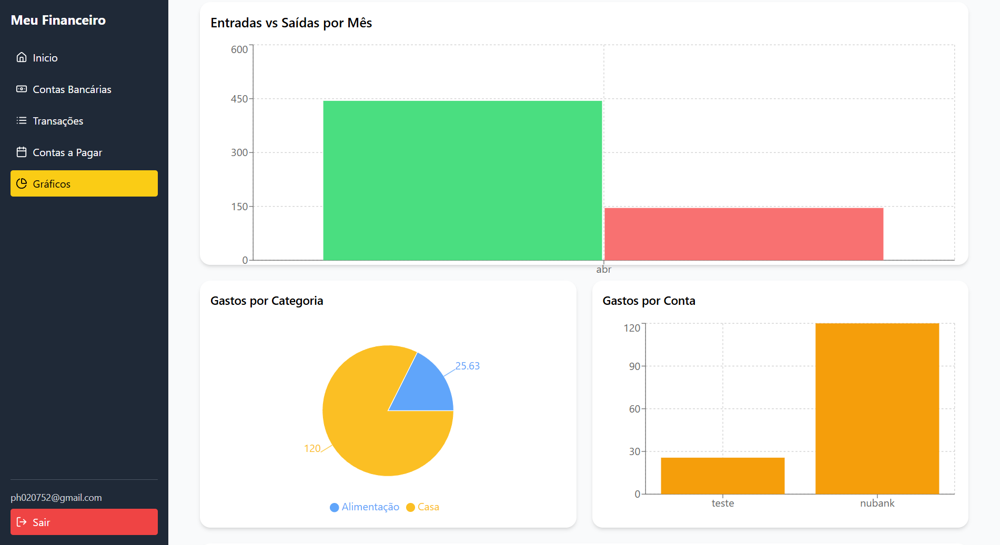

# App Financeiro

Este é um aplicativo web para controle financeiro pessoal, desenvolvido com React e Vite. Permite o gerenciamento de contas bancárias, registro de transações, controle de contas a pagar e visualização de gráficos financeiros com filtros.

## Funcionalidades

- Cadastro e listagem de contas bancárias
- Registro de entradas e saídas financeiras
- Controle de contas a pagar
- Filtros por mês, categoria e conta
- Gráficos de evolução e distribuição
- Autenticação de usuários
- Armazenamento em nuvem com Firebase

## Tecnologias

- React
- Vite
- Firebase (Authentication e Firestore)
- Tailwind CSS
- Recharts
- React Router DOM

## Instalação

```bash
git clone https://github.com/seu-usuario/seu-repositorio.git
cd seu-repositorio
npm install
npm run dev
```

## Variáveis de ambiente

{
VITE_APIKEYFIREBASE = ""
VITE_AUTH_DOMAIN = ""
VITE_PROJECT_ID = ""
VITE_STORAGE_BUCKET = ""
VITE_MESSAGING_SENDER_ID = ""
VITE_APP_ID = ""
}

## Imagens



